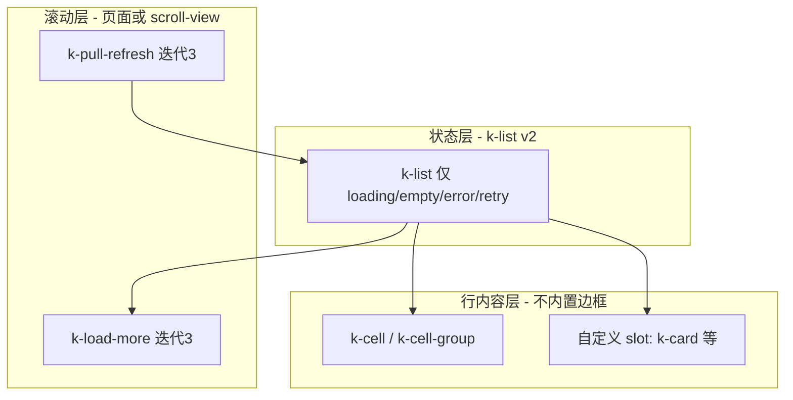

# k-list 架构重构与二期列表规划

> 更新日期：2026-06-26  
> 状态：**v2 已实施（2026-06-26），待三端冒烟** — 见 `docs/k-list三端冒烟验收清单.md`  
> 触发：v1 实现与真实列表页形态偏差（边框/双轨行组件/与 k-cell 高度重叠）

---

## 1. 问题诊断（v1 偏差）

### 1.1 真实业务里的「列表页」

```text
scroll-view / 页面滚动
├── [可选] 筛选 / Tabs
├── 内容区（无边框、与页面背景一体）
│   ├── 通栏 cell 行（设置型、消息摘要）
│   ├── 自定义卡片 slot（订单、商品）
│   └── 分组 cell-group（带标题的设置块）
├── loading / empty / error（区块级，非「列表 UI 框」）
└── [可选] 上拉 load-more / 下拉 refresh
```

### 1.2 v1 实现偏差

| 维度 | 真实预期 | v1 现状 | 问题 |
| --- | --- | --- | --- |
| 容器视觉 | 无外层边框，内容承载 | 默认 `border`、可选 `inset` 卡片 | 像 cell-group 而非列表页 |
| 行原语 | `k-cell` 已是「列表中的单项」 | 新增 `k-list-item` 平行体系 | 双轨维护、API 重叠 |
| 三态 | 有价值 | loading/empty/error 已实现 | **唯一应保留的核心增量** |
| 注册机制 | 简单 props 驱动 | itemChildren + cell-group 双注册 | APP inject 踩坑、空态误判 |
| 与迭代 3 | 挂 refresh/load-more | 仅 footer 预留 | 容器职责未收敛 |

### 1.3 结论

- **`k-list` 有必要**，但应收敛为 **异步状态壳（List State Shell）**，不是第二套 cell 列表。
- **`k-list-item` 不应作为一期承诺组件**，行能力统一由 **`k-cell` + 业务 slot** 承担。
- **二期** 在状态壳之上补：**空态插画 `k-empty`、虚拟列表、滑动操作**，而非再扩 list-item。

---

## 2. 目标架构（一步到位）

### 2.1 三层分工



| 层级 | 组件 | 职责 | 一期 | 二期 |
| --- | --- | --- | --- | --- |
| 状态层 | `k-list` | loading / empty / error / retry；透明背景、无边框 | **v2 重构** | 与 load-more 联动 |
| 行层 | `k-cell` / `k-cell-group` | 通栏行、分组、inset 卡片、链接 | 已有 | swipe 扩展 |
| 空态增强 | `k-empty` | 插画 + 描述 + 操作按钮 | 占位文案在 k-list | **独立组件** |
| 滚动增强 | `k-pull-refresh` / `k-load-more` | 刷新与分页 | 迭代 3 | — |
| 性能 | `k-virtual-list` | 长列表 | — | **二期 P1** |

### 2.2 k-list v2 API（收敛版）

**保留**

| 属性 / 能力 | 说明 |
| --- | --- |
| `loading` / `error` / `empty` | 三态 + 显式 empty（动态列表必绑） |
| `loadingText` / `emptyText` / `errorText` | 默认文案 |
| `finished` | 预留 load-more |
| slot: `default` / `loading` / `empty` / `error` / `footer` | 与 v1 一致 |
| `@retry` | 错误重试 |

**删除（breaking）**

| 移除项 | 原因 |
| --- | --- |
| `border` / `inset` | 视觉属于 cell-group 或页面布局 |
| v1 itemChildren 空态自动计数 | 改为显式 `:empty` |
| `k-list-register-content`（cell-group 挂钩） | 不再需要 |
| **`k-list-item` 整个组件** | 由 k-cell 替代 |

**v2.1 有意保留（非 v1 注册链）**

| 能力 | 说明 |
| --- | --- |
| `cell-border.uts` | 平铺 `k-cell` 时代理项间分割线，支持 register/unregister |
| inject 键 | `k-collapse-register-child`（兼容）+ `k-cell-unregister-child` |

**默认值调整**

| 属性 | v1 | v2 |
| --- | --- | --- |
| 容器背景 | `#fff` | `transparent`（继承页面） |
| 容器边框 | 可选 border | 无 |
| loading 实现 | k-ring-spinner | 保持（已验证三端） |

### 2.3 标准页面范式（重构后 demo 主线）

```vue
<!-- 订单列表示例 -->
<scroll-view style="flex:1">
  <k-list
    :loading="loading"
    :error="error"
    :empty="!loading && !error && orders.length == 0"
    @retry="fetchOrders"
  >
    <k-cell
      v-for="item in orders"
      :key="item.id"
      :title="item.title"
      :label="item.time"
      :right-text="item.status"
      is-link
      @click="openDetail(item)"
    />
  </k-list>
  <k-load-more v-if="!finished" :loading="loadingMore" @load="loadMore" />
</scroll-view>
```

```vue
<!-- 设置块 + 三态 -->
<k-list :empty="groups.length == 0" empty-text="暂无设置项">
  <k-cell-group v-for="g in groups" :key="g.id" :title="g.title">
    <k-cell v-for="c in g.items" :key="c.id" ... />
  </k-cell-group>
</k-list>
```

---

## 3. 一步到位实施计划（建议 2~3 天）

### 阶段 R0~R3：✅ 代码已实施（2026-06-26）

- [x] 删除 `k-list-item`
- [x] k-list 收敛为状态壳（无 border/inset）
- [x] 平铺 cell 分割线：`cell-border.uts` + unregister
- [x] L1/L2：`k-empty` / `k-load-more` 联动
- [x] 质量批次 A~D（见 `docs/k-list质量提升与9.8目标方案.md`）
- [ ] 三端冒烟勾选（9.5+ 门禁）

### 阶段 R1：k-list 瘦身（1 天）

| 任务 | 说明 |
| --- | --- |
| 删除 border/inset props 及样式 | 容器零 chrome |
| 删除 provide/inject 注册链 | list-item.type.uts 仅保留若仍有引用则删 |
| 删除 k-cell-group 的 list 内容注册 | 回滚 `k-list-register-content` 改动 |
| 背景默认 transparent | 状态区 min-height 保留 |
| 三态逻辑保留 | loading > error > empty > default；`:empty` 显式绑定 |

### 阶段 R2：移除 k-list-item（0.5 天）

| 任务 | 说明 |
| --- | --- |
| 删除 `uni_modules/kit-ui/components/k-list-item/` | 目录级移除 |
| 重写 `pages/list/list.uvue` | 主线：cell 列表 + 三态 + cell-group 分组 |
| 首页 / pages.json | List 入口保留，文案改为「列表状态容器」 |

### 阶段 R3：文档与验收（0.5~1 天）

| 任务 | 说明 |
| --- | --- |
| `k-list/README.md` | v2 API + 与 k-cell 分工 + 迁移表 |
| `docs/k-list三端冒烟验收清单.md` | 按 v2 用例重写 |
| `docs/k-list开发计划.md` | 标记 v1 归档，指向本文 |
| 三端冒烟 | WEB / APP / MP：三态 + cell 长文案 + 无 list-item |

### 迁移对照（v1 → v2）

| v1 | v2 |
| --- | --- |
| `<k-list-item title desc clickable>` | `<k-cell title :label="desc" clickable>` |
| prefix 头像 slot | `<k-cell><template #icon><k-avatar /></template>` |
| suffix 标签 | `<k-cell><template #extra><k-tag /></template>` |
| `<k-list border inset>` | `<k-cell-group inset>` 或页面 padding |
| 自动 empty（item 计数） | `:empty="items.length == 0"` 显式绑定 |

---

## 4. 一期迭代口径调整

### 4.1 迭代 2 DoD（修订）

- [x] 弹层与反馈闭环
- [ ] **列表页可演示**：k-list 三态 + k-cell 承载行 + 长内容/空态/错误重试（**不依赖 k-list-item**）

### 4.2 看板任务修订

| 原任务 | 修订后 |
| --- | --- |
| k-list + k-list-item | **k-list v2（状态容器）** |
| k-list-item 已完成 | **取消**，合并进 k-cell 文档示例 |

### 4.3 组件清单修订

| 组件 | 一期状态 | 说明 |
| --- | --- | --- |
| `k-list` | **v2 已完成** | P0，状态壳 + footer load-more |
| `k-list-item` | 已完成 → **不纳入一期** | 删除，避免双轨 |
| `k-cell` | 已完成 | **唯一行原语** |
| `k-empty` | **L1 已完成（v1 图标占位）** | k-list empty slot 默认渲染 |
| `k-load-more` | **L2 已完成** | k-list footer 内置联动 |

---

## 5. 二期列表生态规划（提升版）

> 二期主题：**在状态壳 + cell 行基座上，补性能、交互、空态表达** — 不再新增平行行组件。

### 5.1 二期批次 L（列表增强，建议 2~3 周）

| 顺序 | 组件 | 优先级 | 能力 | 依赖 |
| --- | --- | --- | --- | --- |
| L1 | `k-empty` | P1 | 插画/图标 + 描述 + 默认 slot 操作 | ✅ 已落地 |
| L2 | `k-load-more` | P0 | 与 k-list.finished / footer 联动 | ✅ 已落地 |
| L3 | `k-pull-refresh` | P0 | 包裹 k-list + scroll-view 标准范式 | ✅ 已落地 |
| L4 | `k-virtual-list` | P1 | 长列表回收渲染 | 独立，不替换 k-list |
| L5 | `k-swipe-action` | P1 | cell 侧滑菜单 | 基于 k-cell 扩展 |

### 5.2 二期不做（明确排除）

| 项 | 原因 |
| --- | --- |
| 恢复 / 增强 `k-list-item` | 与 k-cell 重复 |
| k-list 边框/inset 能力 | 归属 cell-group |
| k-list 内置 scroll-view | 平台差异大，页面组合更稳 |
| 业务卡片（订单卡/商品卡） | 不纳入 kit-ui 核心 |

### 5.3 二期标准列表页（目标形态）

```text
k-navbar（迭代3）
└─ k-pull-refresh
     └─ k-list（三态）
          ├─ k-cell × N  或  k-card slot
          └─ footer → k-load-more
空态：k-list empty slot → 默认 k-empty 组件
错误：k-list error → retry → toast 反馈（已有链路）
```

### 5.4 与竞品对齐参考

| 库 | 列表容器 | 行 | 空态 |
| --- | --- | --- | --- |
| Vant | List（load 状态） | Cell | Empty |
| uView | 无独立 list 壳 | Cell | Empty |
| **kit-ui v2** | **k-list（三态壳）** | **k-cell** | **k-empty（二期）** |

---

## 6. 风险与决策记录

| 风险 | 决策 |
| --- | --- |
| v1 刚写完就删 list-item | 接受；无发版用户，一步到位成本低于长期双轨 |
| k-cell 能否覆盖信息流行 | 用 label/right-text/icon/extra slot 覆盖 demo 全部 list-item 场景 |
| 动态 empty 必须手绑 | 文档强制示例 `:empty="arr.length==0"`，不再自动计数 |
| 迭代 3 load-more 重复排期 | 重构 k-list 时保留 finished/footer，与 L2/L3 合并实施 |

---

## 7. 建议执行顺序（总览）

```text
当前（迭代 2 收口前）
├── R0~R3：k-list v2 + 删除 k-list-item（2~3 天）← 优先
├── 迭代 2 验收：三态 + cell 列表 demo
└── swiper 增强（可并行）

迭代 3（导航 + 滚动）
├── k-pull-refresh / k-load-more（与 §5.1 L2/L3 合并）
└── navbar / tabs / tabbar

二期批次 L
├── k-empty
├── k-virtual-list
└── k-swipe-action
```

---

## 8. 相关文档

| 文档 | 用途 |
| --- | --- |
| `docs/k-list开发计划.md` | v1 历史（归档） |
| `docs/一期组件迭代看板.md` | 任务状态 |
| `docs/一期下一步开发计划.md` | 迭代排期 |
| `docs/组件开发清单.md` | 组件状态 |
| `uni_modules/kit-ui/components/k-cell/README.md` | 行原语 API |

---

## 9. 修订记录

| 日期 | 说明 |
| --- | --- |
| 2026-06-26 | 初版：v1 偏差分析 + k-list v2 一步到位方案 + 二期列表生态 |
