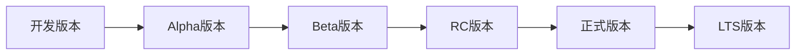
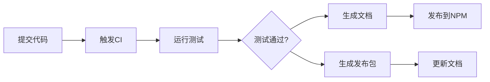

# kit-ui 发布与部署策略

## 版本管理策略

### 1. 语义化版本控制

#### 版本号格式

```base
主版本号.次版本号.修订号[-预发布标识][+构建元数据]
例如：1.2.3-beta.1+20231201
```

#### 版本递增规则

- **主版本号 (MAJOR)**：不兼容的 API 修改
- **次版本号 (MINOR)**：向下兼容的功能性新增
- **修订号 (PATCH)**：向下兼容的问题修正
- **预发布版本**：alpha、beta、rc

#### 版本生命周期



### 2. 分支管理策略

#### Git Flow 分支模型

```base
main (生产分支)
├── develop (开发分支)
│   ├── feature/button-component
│   ├── feature/form-validation
│   └── feature/theme-system
├── release/v1.2.0 (发布分支)
├── hotfix/v1.1.1 (热修复分支)
└── support/v1.x (长期支持分支)
```

#### 分支职责

- **main**: 生产环境代码，每个提交都是一个发布版本
- **develop**: 开发环境代码，集成最新功能
- **feature/***: 功能开发分支，从 develop 分出
- **release/***: 发布准备分支，从 develop 分出
- **hotfix/***: 紧急修复分支，从 main 分出
- **support/***: 长期支持分支，维护旧版本

### 3. 发布流程

#### 自动化发布流程



#### 手动发布流程


#### 手动发布检查清单

```markdown
- [ ] 代码提交记录清晰
- [ ] 提交信息符合规范
- [ ] 代码风格一致
- [ ] 文档更新
- [ ] 版本号更新
- [ ] 发布说明准备
- [ ] 测试覆盖率达标
- [ ] 发布前检查通过
- [ ] 发布后测试通过
- [ ] 发布后文档更新
```

## 发布前检查清单

### 代码质量

- [ ] 所有测试通过
- [ ] 代码覆盖率达标 (>80%)
- [ ] ESLint 检查通过
- [ ] TypeScript 类型检查通过
- [ ] 性能测试通过
- [ ] 可访问性测试通过

### 文档更新

- [ ] API 文档已更新
- [ ] 组件示例已更新
- [ ] 迁移指南已编写（破坏性更改）
- [ ] CHANGELOG.md 已更新
- [ ] README.md 已更新

### 兼容性测试

- [ ] H5 平台测试通过
- [ ] 微信小程序测试通过
- [ ] 支付宝小程序测试通过
- [ ] App 平台测试通过
- [ ] 鸿蒙平台测试通过

### 版本信息

- [ ] 版本号符合语义化规范
- [ ] package.json 版本已更新
- [ ] Git 标签已创建
- [ ] 发布说明已准备

## 包管理与分发

### 1. NPM 包发布

#### 包结构设计

```base
kit-ui/
├── packages/
│   ├── components/          # 主组件包
│   │   ├── package.json
│   │   ├── dist/
│   │   │   ├── index.js     # UMD 格式
│   │   │   ├── index.es.js  # ES 模块
│   │   │   ├── index.d.ts   # 类型定义
│   │   │   └── style.css    # 样式文件
│   │   └── src/
│   ├── utils/               # 工具函数包
│   │   ├── package.json
│   │   └── dist/
│   ├── theme/               # 主题包
│   │   ├── package.json
│   │   └── dist/
│   └── icons/               # 图标包
│       ├── package.json
│       └── dist/
└── package.json             # 根包（元包）

```

#### 包配置文件

```json
// packages/components/package.json
{
  "name": "@kit-ui/components",
  "version": "1.0.0",
  "description": "kit-ui 组件库核心组件",
  "main": "dist/index.js",
  "module": "dist/index.es.js",
  "types": "dist/index.d.ts",
  "exports": {
    ".": {
      "import": "./dist/index.es.js",
      "require": "./dist/index.js",
      "types": "./dist/index.d.ts"
    },
    "./style": "./dist/style.css",
    "./package.json": "./package.json"
  },
  "files": [
    "dist",
    "README.md",
    "CHANGELOG.md"
  ],
  "keywords": [
    "vue",
    "vue3",
    "uni-app",
    "uniapp-x",
    "components",
    "ui",
    "kit-ui"
  ],
  "author": "kit-ui Team",
  "license": "MIT",
  "repository": {
    "type": "git",
    "url": "https://github.com/kit-ui/kit-ui.git",
    "directory": "packages/components"
  },
  "bugs": {
    "url": "https://github.com/kit-ui/kit-ui/issues"
  },
  "homepage": "https://kit-ui.github.io",
  "peerDependencies": {
    "vue": "^3.3.0"
  },
  "dependencies": {
    "@kit-ui/utils": "workspace:*",
    "@kit-ui/theme": "workspace:*"
  },
  "publishConfig": {
    "access": "public",
    "registry": "https://registry.npmjs.org"
  }
}
```

#### 发布脚本

```typescript
// scripts/release/publish.ts
import { execSync } from 'child_process'
import { readFileSync, writeFileSync } from 'fs'
import { resolve } from 'path'
import semver from 'semver'

interface ReleaseOptions {
  type: 'patch' | 'minor' | 'major' | 'prerelease'
  preid?: 'alpha' | 'beta' | 'rc'
  dry?: boolean
}

export async function release(options: ReleaseOptions) {
  const { type, preid, dry = false } = options
  
  // 1. 检查工作区状态
  checkWorkspace()
  
  // 2. 运行测试
  console.log('🧪 Running tests...')
  execSync('pnpm test', { stdio: 'inherit' })
  
  // 3. 构建项目
  console.log('🔨 Building packages...')
  execSync('pnpm build', { stdio: 'inherit' })
  
  // 4. 更新版本号
  const newVersion = updateVersion(type, preid)
  console.log(`📦 New version: ${newVersion}`)
  
  // 5. 生成变更日志
  console.log('📝 Generating changelog...')
  execSync('pnpm changelog', { stdio: 'inherit' })
  
  // 6. 提交更改
  if (!dry) {
    console.log('💾 Committing changes...')
    execSync(`git add .`)
    execSync(`git commit -m "chore: release v${newVersion}"`)
    execSync(`git tag v${newVersion}`)
  }
  
  // 7. 发布包
  if (!dry) {
    console.log('🚀 Publishing packages...')
    execSync('pnpm publish -r --access public', { stdio: 'inherit' })
    
    // 8. 推送到远程
    execSync('git push origin main --tags')
  }
  
  console.log('✅ Release completed!')
}

function checkWorkspace() {
  try {
    execSync('git diff --exit-code', { stdio: 'pipe' })
    execSync('git diff --cached --exit-code', { stdio: 'pipe' })
  } catch {
    throw new Error('Working directory is not clean')
  }
}

function updateVersion(type: string, preid?: string): string {
  const packagePath = resolve(__dirname, '../../package.json')
  const pkg = JSON.parse(readFileSync(packagePath, 'utf8'))
  
  const currentVersion = pkg.version
  const newVersion = semver.inc(currentVersion, type as any, preid)
  
  if (!newVersion) {
    throw new Error('Failed to increment version')
  }
  
  // 更新根包版本
  pkg.version = newVersion
  writeFileSync(packagePath, JSON.stringify(pkg, null, 2) + '\n')
  
  // 更新子包版本
  const packages = ['components', 'utils', 'theme', 'icons']
  packages.forEach(name => {
    const pkgPath = resolve(__dirname, `../../packages/${name}/package.json`)
    const subPkg = JSON.parse(readFileSync(pkgPath, 'utf8'))
    subPkg.version = newVersion
    writeFileSync(pkgPath, JSON.stringify(subPkg, null, 2) + '\n')
  })
  
  return newVersion
}
```

## 文档部署

### 1. 文档站点部署

#### 文档构建配置

```typescript
// docs/.vitepress/config.ts
import { defineConfig } from 'vitepress'
import { resolve } from 'path'

export default defineConfig({
  title: 'kit-ui',
  description: '基于 uni-app x 的跨端组件库',
  base: process.env.NODE_ENV === 'production' ? '/kit-ui/' : '/',
  
  head: [
    ['link', { rel: 'icon', href: '/favicon.ico' }],
    ['meta', { name: 'theme-color', content: '#646cff' }],
    ['meta', { name: 'og:type', content: 'website' }],
    ['meta', { name: 'og:locale', content: 'zh-CN' }],
    ['meta', { name: 'og:site_name', content: 'kit-ui' }],
    ['meta', { name: 'og:image', content: 'https://kit-ui.github.io/og-image.png' }]
  ],
  
  themeConfig: {
    logo: '/logo.svg',
    
    nav: [
      { text: '指南', link: '/guide/' },
      { text: '组件', link: '/components/' },
      { text: 'API', link: '/api/' },
      {
        text: '生态',
        items: [
          { text: 'GitHub', link: 'https://github.com/kit-ui/kit-ui' },
          { text: 'NPM', link: 'https://www.npmjs.com/package/@kit-ui/components' },
          { text: 'Playground', link: 'https://kit-ui.github.io/playground' }
        ]
      }
    ],
    
    sidebar: {
      '/guide/': [
        {
          text: '开始',
          items: [
            { text: '介绍', link: '/guide/' },
            { text: '快速开始', link: '/guide/quickstart' },
            { text: '安装', link: '/guide/installation' }
          ]
        },
        {
          text: '进阶',
          items: [
            { text: '主题定制', link: '/guide/theming' },
            { text: '国际化', link: '/guide/i18n' },
            { text: '按需导入', link: '/guide/tree-shaking' }
          ]
        }
      ],
      '/components/': [
        {
          text: '基础组件',
          items: [
            { text: 'Button 按钮', link: '/components/button' },
            { text: 'Icon 图标', link: '/components/icon' },
            { text: 'Layout 布局', link: '/components/layout' }
          ]
        },
        {
          text: '表单组件',
          items: [
            { text: 'Input 输入框', link: '/components/input' },
            { text: 'Select 选择器', link: '/components/select' },
            { text: 'Form 表单', link: '/components/form' }
          ]
        }
      ]
    },
    
    socialLinks: [
      { icon: 'github', link: 'https://github.com/kit-ui/kit-ui' }
    ],
    
    footer: {
      message: 'Released under the MIT License.',
      copyright: 'Copyright © 2023-present kit-ui Team'
    },
    
    search: {
      provider: 'algolia',
      options: {
        appId: 'YOUR_APP_ID',
        apiKey: 'YOUR_API_KEY',
        indexName: 'kit-ui'
      }
    }
  },
  
  vite: {
    resolve: {
      alias: {
        '@kit-ui/components': resolve(__dirname, '../../packages/components/src'),
        '@kit-ui/utils': resolve(__dirname, '../../packages/utils/src'),
        '@kit-ui/theme': resolve(__dirname, '../../packages/theme/src')
      }
    }
  }
})
```

### 2. API 文档自动生成

#### TypeDoc 配置

```json
// typedoc.json
{
  "entryPoints": [
    "packages/components/src/index.ts",
    "packages/utils/src/index.ts",
    "packages/theme/src/index.ts"
  ],
  "out": "docs/api",
  "theme": "default",
  "name": "kit-ui API Documentation",
  "includeVersion": true,
  "excludePrivate": true,
  "excludeProtected": true,
  "excludeExternals": true,
  "readme": "none",
  "plugin": [
    "typedoc-plugin-markdown"
  ],
  "gitRevision": "main",
  "gitRemote": "origin"
}
```

#### 文档生成脚本

```typescript
// scripts/docs/generate-api.ts
import { Application, TSConfigReader, TypeDocReader } from 'typedoc'
import { resolve } from 'path'

export async function generateApiDocs() {
  const app = new Application()
  
  app.options.addReader(new TSConfigReader())
  app.options.addReader(new TypeDocReader())
  
  app.bootstrap({
    entryPoints: [
      resolve(__dirname, '../../packages/components/src/index.ts'),
      resolve(__dirname, '../../packages/utils/src/index.ts'),
      resolve(__dirname, '../../packages/theme/src/index.ts')
    ],
    tsconfig: resolve(__dirname, '../../tsconfig.json')
  })
  
  const project = app.convert()
  
  if (project) {
    const outputDir = resolve(__dirname, '../../docs/api')
    await app.generateDocs(project, outputDir)
    console.log('✅ API documentation generated!')
  } else {
    console.error('❌ Failed to generate API documentation')
    process.exit(1)
  }
}
```

## 监控与反馈

### 1. 使用统计监控

#### NPM 下载统计

```typescript
// scripts/analytics/npm-stats.ts
import fetch from 'node-fetch'

interface DownloadStats {
  downloads: number
  start: string
  end: string
  package: string
}

export async function getNpmStats(packageName: string, period = 'last-month'): Promise<DownloadStats> {
  const url = `https://api.npmjs.org/downloads/point/${period}/${packageName}`
  const response = await fetch(url)
  
  if (!response.ok) {
    throw new Error(`Failed to fetch NPM stats: ${response.statusText}`)
  }
  
  return response.json() as Promise<DownloadStats>
}

export async function generateUsageReport() {
  const packages = [
    '@kit-ui/components',
    '@kit-ui/utils',
    '@kit-ui/theme',
    '@kit-ui/icons'
  ]
  
  const stats = await Promise.all(
    packages.map(pkg => getNpmStats(pkg))
  )
  
  const report = {
    timestamp: new Date().toISOString(),
    totalDownloads: stats.reduce((sum, stat) => sum + stat.downloads, 0),
    packages: stats.map(stat => ({
      name: stat.package,
      downloads: stat.downloads,
      period: `${stat.start} to ${stat.end}`
    }))
  }
  
  console.log('📊 Usage Report:')
  console.table(report.packages)
  
  return report
}
```

### 3. 用户反馈收集

#### GitHub Issues 模板

```yaml
# .github/ISSUE_TEMPLATE/bug_report.yml
name: Bug Report
description: 报告一个 bug
title: "[Bug]: "
labels: ["bug", "triage"]
body:
  - type: markdown
    attributes:
      value: |
        感谢您报告 bug！请填写以下信息帮助我们更好地定位问题。
  
  - type: textarea
    id: description
    attributes:
      label: 问题描述
      description: 请详细描述遇到的问题
      placeholder: 描述问题的现象和期望的行为
    validations:
      required: true
  
  - type: textarea
    id: reproduction
    attributes:
      label: 重现步骤
      description: 请提供重现问题的步骤
      placeholder: |
        1. 打开页面
        2. 点击按钮
        3. 看到错误
    validations:
      required: true
  
  - type: input
    id: version
    attributes:
      label: kit-ui 版本
      placeholder: "1.0.0"
    validations:
      required: true
  
  - type: dropdown
    id: platform
    attributes:
      label: 平台
      multiple: true
      options:
        - H5
        - 微信小程序
        - 支付宝小程序
        - App (Android)
        - App (iOS)
        - 鸿蒙
    validations:
      required: true
  
  - type: textarea
    id: environment
    attributes:
      label: 环境信息
      description: 请提供相关的环境信息
      placeholder: |
        - uni-app 版本:
        - Vue 版本:
        - 浏览器版本:
        - 设备型号:
    validations:
      required: true
  
  - type: textarea
    id: additional
    attributes:
      label: 其他信息
      description: 任何其他有助于解决问题的信息
```

#### 功能请求模板

```yaml
# .github/ISSUE_TEMPLATE/feature_request.yml
name: Feature Request
description: 请求新功能
title: "[Feature]: "
labels: ["enhancement", "triage"]
body:
  - type: markdown
    attributes:
      value: |
        感谢您的功能建议！请填写以下信息。
  
  - type: textarea
    id: problem
    attributes:
      label: 问题描述
      description: 这个功能请求是为了解决什么问题？
      placeholder: 我希望能够...
    validations:
      required: true
  
  - type: textarea
    id: solution
    attributes:
      label: 期望的解决方案
      description: 您希望这个功能如何工作？
      placeholder: 我希望组件能够...
    validations:
      required: true
  
  - type: textarea
    id: alternatives
    attributes:
      label: 替代方案
      description: 您考虑过其他替代方案吗？
      placeholder: 我也考虑过...
  
  - type: checkboxes
    id: platforms
    attributes:
      label: 目标平台
      description: 这个功能应该在哪些平台上可用？
      options:
        - label: H5
        - label: 微信小程序
        - label: 支付宝小程序
        - label: App
        - label: 鸿蒙
  
  - type: textarea
    id: additional
    attributes:
      label: 其他信息
      description: 任何其他相关信息
```

## 版本维护策略

### 1. 长期支持 (LTS) 版本

#### LTS 版本规划

```base
版本 1.x (LTS) - 2024.01 ~ 2026.01
├── 1.0.0 (初始发布)
├── 1.1.0 (功能更新)
├── 1.2.0 (功能更新)
└── 1.x.x (安全修复)

版本 2.x (LTS) - 2025.01 ~ 2027.01
├── 2.0.0 (重大更新)
├── 2.1.0 (功能更新)
└── 2.x.x (安全修复)
```

#### 维护策略

- **活跃维护期**: 18个月（新功能 + 问题修复）
- **维护期**: 12个月（仅安全修复）
- **生命周期结束**: 停止所有更新

### 2. 迁移指南

#### 自动迁移工具

```typescript
// scripts/migration/migrate.ts
import { readFileSync, writeFileSync } from 'fs'
import { glob } from 'glob'
import { transform } from '@babel/core'

interface MigrationRule {
  from: string
  to: string
  type: 'import' | 'component' | 'prop' | 'method'
  description: string
}

const migrationRules: MigrationRule[] = [
  {
    from: 'u-button',
    to: 'k-button',
    type: 'component',
    description: '组件名称从 u-button 更改为 k-button'
  },
  {
    from: 'UButton',
    to: 'KButton',
    type: 'import',
    description: '导入名称从 UButton 更改为 KButton'
  }
]

export async function migrate(projectPath: string, fromVersion: string, toVersion: string) {
  console.log(`🔄 Migrating from ${fromVersion} to ${toVersion}...`)
  
  const files = await glob('**/*.{vue,js,ts}', {
    cwd: projectPath,
    ignore: ['node_modules/**', 'dist/**']
  })
  
  let changedFiles = 0
  
  for (const file of files) {
    const filePath = `${projectPath}/${file}`
    const content = readFileSync(filePath, 'utf8')
    let newContent = content
    let hasChanges = false
    
    for (const rule of migrationRules) {
      const regex = new RegExp(rule.from, 'g')
      if (regex.test(newContent)) {
        newContent = newContent.replace(regex, rule.to)
        hasChanges = true
        console.log(`  ✅ ${file}: ${rule.description}`)
      }
    }
    
    if (hasChanges) {
      writeFileSync(filePath, newContent)
      changedFiles++
    }
  }
  
  console.log(`✅ Migration completed! ${changedFiles} files updated.`)
}
```
