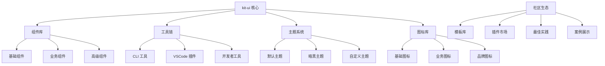

# kit-ui 生态建设与社区运营

## 生态系统规划

### 1. 核心生态组件

#### 生态架构图



#### 生态包规划

```typescript
// 生态包结构
interface EcosystemPackages {
  core: {
    '@kit-ui/components': '核心组件库'
    '@kit-ui/utils': '工具函数库'
    '@kit-ui/theme': '主题系统'
    '@kit-ui/icons': '图标库'
  }
  
  toolchain: {
    '@kit-ui/cli': 'CLI 工具'
    '@kit-ui/vscode': 'VSCode 插件'
    '@kit-ui/devtools': '开发者工具'
    '@kit-ui/playground': '在线演示'
  }
  
  templates: {
    '@kit-ui/template-admin': '管理后台模板'
    '@kit-ui/template-mobile': '移动端模板'
    '@kit-ui/template-ecommerce': '电商模板'
    '@kit-ui/template-blog': '博客模板'
  }
  
  plugins: {
    '@kit-ui/plugin-charts': '图表插件'
    '@kit-ui/plugin-editor': '富文本编辑器'
    '@kit-ui/plugin-map': '地图组件'
    '@kit-ui/plugin-video': '视频播放器'
  }
  
  community: {
    'awesome-kit-ui': '精选资源列表'
    'kit-ui-examples': '示例项目集合'
    'kit-ui-snippets': '代码片段'
    'kit-ui-themes': '社区主题'
  }
}
```

### 2. CLI 工具开发

#### 项目创建命令

## 社区建设

### 1. 开源社区策略

#### GitHub 仓库管理

```yaml
# .github/CONTRIBUTING.md
# 贡献指南

## 欢迎贡献

感谢您对 kit-ui 的关注！我们欢迎各种形式的贡献。

### 贡献方式

1. **报告 Bug**
   - 使用 Bug Report 模板
   - 提供详细的重现步骤
   - 包含环境信息

2. **功能建议**
   - 使用 Feature Request 模板
   - 描述使用场景
   - 提供设计方案

3. **代码贡献**
   - Fork 仓库
   - 创建功能分支
   - 提交 Pull Request

### 开发流程

1. **环境准备**
   \```bash
   git clone https://github.com/kit-ui/kit-ui.git
   cd kit-ui
   pnpm install
   pnpm dev
   \```

2. **开发规范**
   - 遵循 ESLint 规则
   - 编写单元测试
   - 更新文档
   - 提交信息符合 Conventional Commits

3. **提交 PR**
   - 填写 PR 模板
   - 确保 CI 通过
   - 等待代码审查

### 代码审查

所有代码更改都需要经过代码审查：

- **核心维护者审查**：重大功能和架构变更
- **社区审查**：一般功能和修复
- **自动化检查**：代码质量、测试覆盖率

### 发布流程

1. **版本规划**：每月发布一个 minor 版本
2. **测试验证**：完整的测试流程
3. **文档更新**：同步更新文档
4. **社区通知**：发布说明和迁移指南

```

#### 社区治理结构

### 2. 文档与教程

#### 文档网站架构

```typescript
// docs/config/navigation.ts
export const navigation = {
  guide: {
    title: '指南',
    items: [
      {
        title: '快速开始',
        items: [
          { title: '介绍', link: '/guide/' },
          { title: '安装', link: '/guide/installation' },
          { title: '快速上手', link: '/guide/quickstart' }
        ]
      },
      {
        title: '进阶',
        items: [
          { title: '主题定制', link: '/guide/theming' },
          { title: '国际化', link: '/guide/i18n' },
          { title: '按需导入', link: '/guide/tree-shaking' },
          { title: '跨端适配', link: '/guide/cross-platform' }
        ]
      },
      {
        title: '最佳实践',
        items: [
          { title: '性能优化', link: '/guide/performance' },
          { title: '可访问性', link: '/guide/accessibility' },
          { title: '测试策略', link: '/guide/testing' }
        ]
      }
    ]
  },
  
  components: {
    title: '组件',
    items: [
      {
        title: '基础组件',
        items: [
          { title: 'Button 按钮', link: '/components/button' },
          { title: 'Icon 图标', link: '/components/icon' },
          { title: 'Layout 布局', link: '/components/layout' }
        ]
      },
      {
        title: '表单组件',
        items: [
          { title: 'Input 输入框', link: '/components/input' },
          { title: 'Select 选择器', link: '/components/select' },
          { title: 'Form 表单', link: '/components/form' }
        ]
      },
      {
        title: '反馈组件',
        items: [
          { title: 'Modal 模态框', link: '/components/modal' },
          { title: 'Toast 提示', link: '/components/toast' },
          { title: 'Loading 加载', link: '/components/loading' }
        ]
      }
    ]
  },
  
  ecosystem: {
    title: '生态',
    items: [
      {
        title: '工具',
        items: [
          { title: 'CLI 工具', link: '/ecosystem/cli' },
          { title: 'VSCode 插件', link: '/ecosystem/vscode' },
          { title: '开发者工具', link: '/ecosystem/devtools' }
        ]
      },
      {
        title: '模板',
        items: [
          { title: '管理后台', link: '/ecosystem/template-admin' },
          { title: '移动端应用', link: '/ecosystem/template-mobile' },
          { title: '电商应用', link: '/ecosystem/template-ecommerce' }
        ]
      },
      {
        title: '插件',
        items: [
          { title: '图表插件', link: '/ecosystem/plugin-charts' },
          { title: '编辑器插件', link: '/ecosystem/plugin-editor' },
          { title: '地图插件', link: '/ecosystem/plugin-map' }
        ]
      }
    ]
  },
  
  resources: {
    title: '资源',
    items: [
      {
        title: '学习资源',
        items: [
          { title: '视频教程', link: '/resources/videos' },
          { title: '博客文章', link: '/resources/blogs' },
          { title: '案例研究', link: '/resources/case-studies' }
        ]
      },
      {
        title: '社区',
        items: [
          { title: 'GitHub', link: 'https://github.com/kit-ui/kit-ui' },
          { title: 'Discord', link: 'https://discord.gg/kit-ui' },
          { title: '微信群', link: '/resources/wechat-group' }
        ]
      }
    ]
  }
}
```

#### 贡献者激励机制
